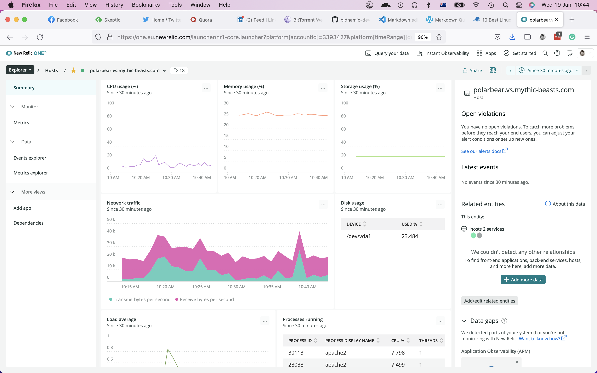

# Terraform

I have no experience of terraform. Looking at job spec sout there, I probably should have. BUT! I prefer docker. An operating systems and all the apps/libaries you need 
all in one container you can run on AWS ECS/EKS or Digital Ocean Droplets.

# Packaging

Packaging could be as simple as creating a tarball with an install script.

Alternatively, push it to your server with Ansible to /var/www/myprojct and add the httpd configuration
into the correct apache or nginx location.

# Deployment

At the base level a git checkout on the server or an rsync from the development box is possibly
the simplest appoach.

Use Ansible/Puppet/Salt/Chef to copy the package and restart the server.

# Security

I've had great fun with rpm2cve on RedHat linux, and snyk to parse the code. From then it's
a case of eyeballing the code, like making sure you're not passing an unescaped string to 
your SQL server and exposing your /etc/passwd of even the database.

# Monitoring

There are lots of choices here:

1. Sematext
2. Zabbix
3. Prometheus and Grafana
4. Nagios Core
5. Elastic Stack
6. SolarWinds Server & Application Monitor (SAM)
7. ManageEngine OpManager
8. PRTG Network Monitor
9. Site24x7
10. Datadog

I've used nagios in the past, and written plugins. It's a bit basic and steam-powered, but it works.

I've recently installed "New Relic One" on my personal server, and it's really quite nice from a 
comprehensive dashboard to mail alerts.

.

# Scaling

The first ways to go is scaling vertically. Have a caching proxy (or CDN) on the front, and split the
web server and database onto separate machines. Then, monitor the machines for CPU, memory, disk 
activity and so on and scale the machines appropriately.

Next, scale horizontally. Have multiple web servers and multiple connected database servers.
Again, monitor closely.

Finally, take the plunge into the modern world, ocntainerise your app and database and 
run them on (for example) kubernetes on AWS. Use k8s autoscaling.

# Troubleshooting

This is a black art.

It could be anything from a failing disk (which I've had) to a failing network card (also had)
or even diodgy memory.

The trick is to be able to make the error reproducible. Then use the tools available to you
to diagnose. That could be from monitoring log files (syslog, apache error_log), creating
core files, using netstat and vmstat.

# Makefile
# Obviously, you'll need .files to configure them. black seems pragmatic
# and I've never argued with pylint.

SOURCE = . 

EXCLUDES = \( \
		-path './.git/*' -o \
		-path './.venv/*' -o \
		-path './venv/*' -o \
		-path './env/*' -o \
		-path './.tox/*' -o \
		-path '.*/node_modules/*' -o \
		-path '.*/bower_components/*' \
\) -prune -o

CMD_PYLINT_CHECK = find . $(EXCLUDES) -name '*.py' -print0 | xargs -0 \
pylint --rcfile $(PWD)/.pylintrc
CMD_PYLINT_REPORT = $(CMD_PYLINT_CHECK) -ry

CMD_FORMATTER = black

pylint:
	# Prints a report of _very_ opinionated code smells in the source files.
	$(foreach dir,$(SOURCE),cd $(dir); $(CMD_PYLINT_REPORT))

pyformatter:
	$(foreach dir,$(SOURCE),cd $(dir); $(CMD_FORMATTER))
